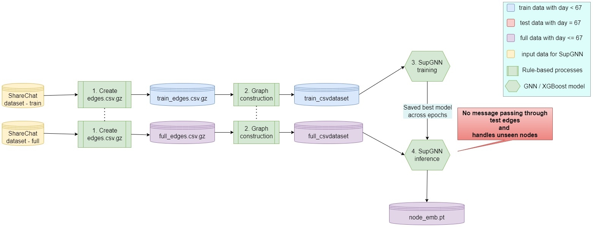
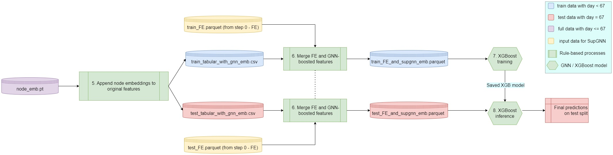

# Supervised Graph Neural Network (aka supGNN) paired with downstream XGBoost model 

## Introduction 
Recommendation datasets are often modelled as graph datasets because of high predictive prowess of Graph Neural Networks. Here, we create a graph dataset by using either a column or a group of columns from ShareChat dataset and train a supervised GraphSage model on it with an emphasis on ensuring no information from test data is used during training and all test examples are inferred independently i.e. no two test edges can see eachother.

<div align="center">
  
  <br>
  <center>Self-supervised bipartite GNN pipeline.</center>
</div>

### !Important

This is an end-to-end README, Train and Inference instructions are both included.

## Set up 
1. Create working directory and subfolders for storing intermediate data files
```bash
mkdir data && cd data
mkdir supGNN_graph_data sharechat_recsys2023_data
cd supGNN_graph_data 
mkdir full_graph train_graph test_graph
```

2. Download ShareChat dataset inside `sharechat_recsys2023_data` folder. It should contain `train` and `test` folders with the given csv files. 

## Running pipeline

### Section 1 : employ Supervised GNN to generate node embeddings
Please see outline for section 1 in following diagram - 

#### Convert tabular data to edge list
We model Group dataset into nodes based on features f_6 for role-1 and f_2, f_4, and f_16 for role-2. </br>
1. Convert tabular training data into training graph
Using only `./sharechat_recsys2023_data/train` folder, we create `./data/supGNN_graph_data/train_graph/train_edges.csv.gz` which will be used for supGNN train/localdisk/akakne/recsys2023/assets/recsys_supgnn.jpging later. 
```bash
python3 0_train/2_supGNN/convert_train_tabular_data_to_edge_list.py
```

2. Create full graph for supGNN inference 
Using both `./sharechat_recsys2023_data/train` and  `./sharechat_recsys2023_data/test` folders, we create `./supGNN_graph_data/full_edges.csv.gz` which will be used for supGNN inference later. 
```bash
python3 1_inference/2_supGNN/convert_full_tabular_data_to_edge_list.py
```
#### Create CSVDataset from edge list
1. Convert training graph into train CSVDataset (for GNN training)
```bash
python3 0_train/2_supGNN/convert_train_edge_list_to_CSVDataset.py
```
Please see newly created files inside `./data/supGNN_graph_data/train_graph/recsys_graph` folder. </br>

2. Convert full graph into full CSVDataset (for GNN inference)
```bash
python3 1_inference/2_supGNN/convert_full_edge_list_to_CSVDataset.py
```
Please see newly created files inside `./data/supGNN_graph_data/full_graph/recsys_graph` folder. 
#### Run supervised Graph Neural Network to generate node embeddings
1. Train supervised GNN on train graph using `./data/supGNN_graph_data/train_graph/recsys_graph`. 
```bash
python3 0_train/2_supGNN/train_supervised_graphsage.py
```
Above script saves best model (across epochs) as `./data/supGNN_graph_data/train_graph/model.pt` </br>
IMPORTANT NOTE : we are using only train graph in this step i.e. GNN model will never see any test data during training. </br>

2. Run inference on full graph using saved GNN model </br>
```bash
python3 1_inference/2_supGNN/infer_supervised_graphsage.py
```
IMPORTANT NOTE : to ensure indepedent testing for all test edges, we disable message passing through test edges i.e. any test edge `e` will see only train and validation edges around it's source and destination nodes. Edge `e` will never see another test edge `e'`. This is done by setting the probablity of picking test edges as neighbours to 0. For more details see our inference code in file `./1_inference/2_supGNN/infer_supervised_graphsage.py` line 112 and 20 respectively. We also handle unseen nodes in this script. </br>

### Section 2 : Create GNN-boosted features and run XGBoost for binary classification
Please see outline for section 2 in following diagram - 

#### Map GNN embeddings to original features 
```bash
python3 1_inference/2_supGNN/map_node_emb_to_edge_list.py
```
this script will map GNN-generated node embeddings to their respective edges and save GNN-boosted features for train and test split separately. 
#### Merge supGNN data with Feature Engineered data 
1. Merge train supGNN data with train FE data 
```bash
python3 0_train/2_supGNN/merge_train_FE_and_train_supgnn_data.py
```
2. Merge test supGNN data with test FE data 
```bash
python3 1_inference/2_supGNN/merge_test_FE_and_test_supgnn_data.py
```
#### Run XGBoost on merged data 
1. Train XGB on merged train data
```bash
python3 0_train/2_supGNN/train_xgb.py
```
2. Infer XGB on merged test data
```bash
python3 1_inference/2_supGNN/infer_xgb.py
```
Finally, we get `./data/supGNN_graph_data/test_graph/submission.csv` as our final submission file which we upload to the leaderboard for evaluation on test set. 