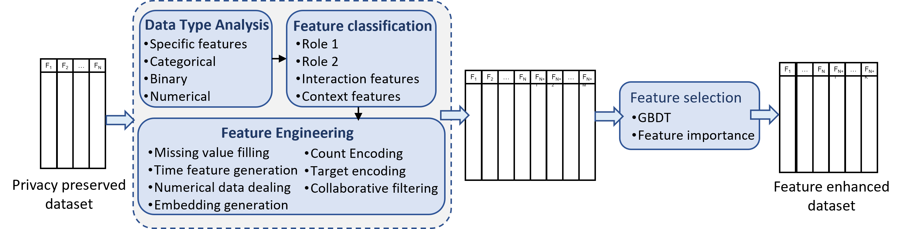
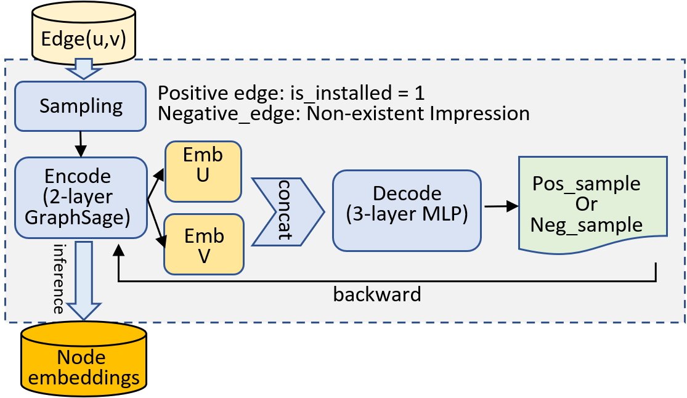
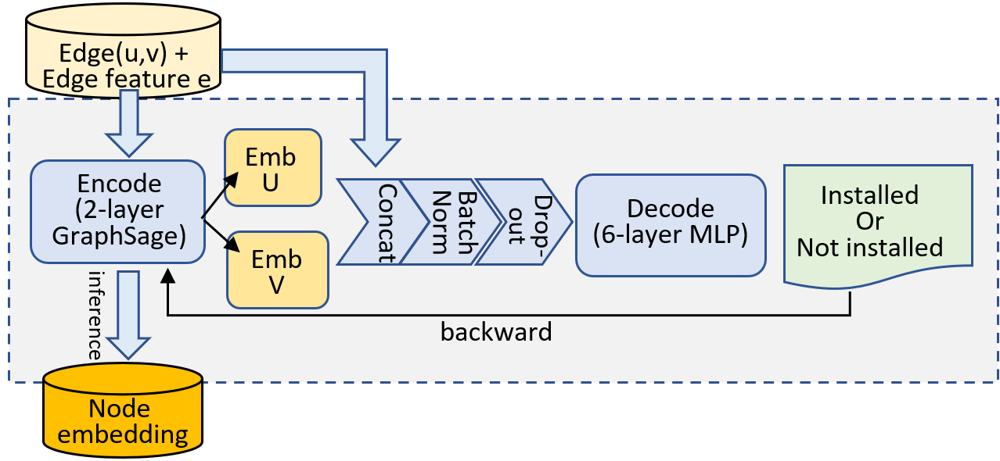
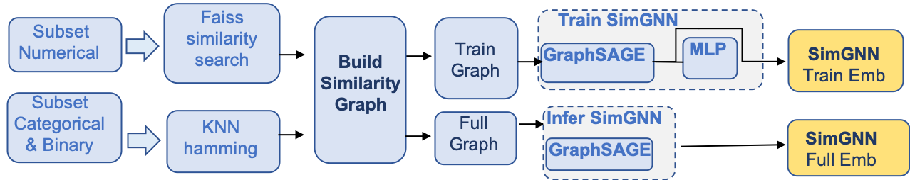
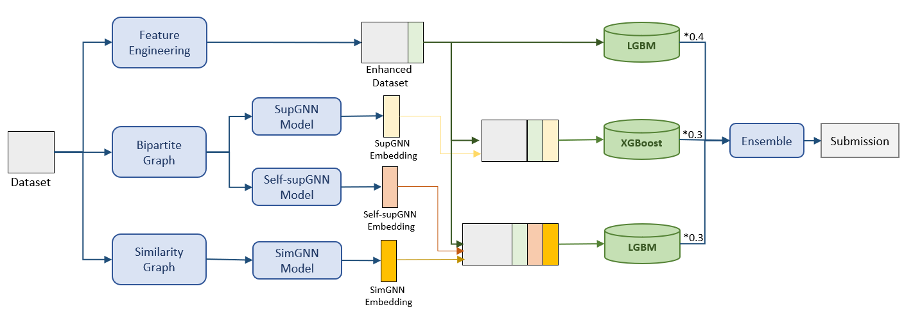

# Intel solution for RecSys challenge 2023

This repository provides the official implementation of Intel solution for RecSys 2023 challenge from the paper: **Graph Enhanced Feature Engineering for Privacy Preserving Recommendation Systems**.

The solution for RecSys Challenge 2023 leverages a novel feature classification method to categorize anonymous features into different groups and apply enhanced feature engineering and graph neural networks to reveal underlying information and improve prediction accuracy. This solution can also be generalized to other privacy preserving recommendation systems. Our team name is LearningFE, final submission got score as 5.892977 and ranks at 2’nd on the leaderboard. 

# Solution Overview
## Feature engineer pipeline 
We propose a novel feature engineering pipeline for privacy-preservation dataset, which is capable of enriching the features' expressiveness based on feature distribution characteristics. This method comprises of three major steps as shown in Figure 1: a) analysis and classification, b) feature engineering, and c) feature selection. 

<div align="center">
  
  <br>
  <center>Figure 1: Feature engineer pipeline overview. Role1 and Role2 refer to users and ads in this dataset. The same holds for rest 'Role' terms in this solution.</center>
</div>

## GNN embedding feature
We employ GNN to generate the embedding feature as input of the GBDT model for installation prediction. Depends on the graph representation, we produce three type of GNN embedding feature: a) self-supervised GNN in Figure 2, b) supervised GNN in Figure 3, c) Similarity GNN in Figure 4.


<div align="center">
  
  
  <br>
  <center>Figure 2: Self-supervised bipartite GNN pipeline. &emsp;&emsp; Figure 3: Supervised bipartite GNN pipeline.</center>
</div>

<div align="center">
  
  <br>
  <center>Figure 4: Similarity GNN pipeline.</center>
</div>

## Model Ensemble
As described in the previous sections, we generate new features: (i) privacy preserving feature engineering output, (ii) supervised bipartite GNN (BiGNN) embeddings, (iii) self-supervised BiGNN embeddings and (iv) similarity Graph GNN (simGNN) embeddings. Using these new features, we build 3 models by using different training methods and feature sets as illustrated in Figure 5. The first model is a LightGBM model trained with enhanced feature sets. The second model is an XGBoost model trained with enhanced feature sets and supervised BiGNN embeddings. The third model is a LightGBM model trained with enhanced feature sets, simGNN embeddings and self-supervised BiGNN embeddings.


<div align="center">
  
  <br>
  <center>Figure 5: Model training and ensemble overview.</center>
</div>


# How to run
## Code layout
``` bash
.
├── README.md
├── LICENSE
├── 0_train
├── 1_inference
├── utils.py
└── data
```

## Instruction for running

* step1: prepare your data
  * put sharechat raw data under data/sharechat_recsys2023_data

* step2: Follow 0_train to complete model training and saving
  * use 1\_LearningFE to create processed data + encoder and LGBM model, see [here](0_train/1_LearningFE/README.md) for details
  * use 2\_supGNN to create GNN model and xgboost model, see [here](0_train/2_supGNN/README.md) for details
  * use 3\_BiGNN to create GNN model, see [here](0_train/3_BiGNN/README.md) for details
  * use 4\_simGNN to create GNN model and LGBM model, see [here](0_train/4_simGNN/README.md) for details

* step3: Follow 1_inference to do test data inference
  * use 1\_LearningFE to inference test data, see [here](1_inference/1_LearningFE/README.md) for details
  * use 2\_supGNN to inference test data, see [here](1_inference/1_LearningFE/README.md) for details
  * use 3\_BiGNN to create inference embeddings, see [here](1_inference/2_supGNN/README.md) for details
  * use 4\_simGNN+BiGNN to inference test data, see [here](1_inference/3_BiGNN/README.md) for details
  * use 5\_ensemble.ipynb to get final result, see [here](1_inference/4_ensemble.ipynb) for details

# Citation
If you use this codebase, or otherwise found our work valuable, please cite:

```
@inproceedings{intelsolutionforrecsys2023,
  title={Graph Enhanced Feature Engineering for Privacy Preserving Recommendation System},
  author={CHENDI XUE, XINYAO WANG, Yu Zhou, Poovaiah Palangappa, Ravi Motwani, Rita Brugarolas Brufau, Aasavari Dhananjay Kakne, Ke Ding, Jian Zhang},
  booktitle={RecSys 2023},
  year={2023}
}
```